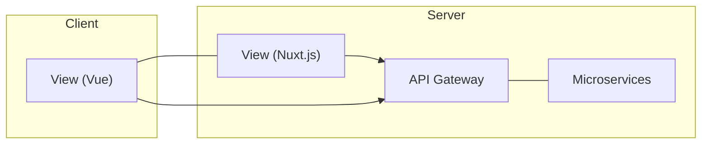

# 서론

 "벼루"플랫폼은 일종의 블로깅 플랫폼으로 기존 블로깅 플랫폼들이 개인의 공간에 글을 올려 개인단위로 운영되는 컨텐츠들을 보여주는것에 초점을 맞춘 반면, 본 플랫폼에서는 개인적인 공간을 없애고 태그를 이용하여 글들의 주제를 중심으로 분류, 컨텐츠 소비자들로 하여끔 자신의 취향인 글들을 찾기 쉽게 하는것에 초점을 맞춘다.


 이 문서는 이 플랫폼을 만드는 과정의 개발일기이다.


# 기본 구조

 본 프로젝트는 Kubernetes 기반으로 운영될것을 고려한 Microservice Architecture 구조를 채택하고 있으며 각 Microservice는 Stateless 한 상태를 가질것을 전재로 개발되고있다. Frontend는 Nuxt.js를 사용한 Vue SPA 구조를 가지며 Backend는 일단 Node.js 로 통일한다.

 벼루는 크게 3부분으로 나뉜다.



 View는 Nuxt.js를 이용한 Vue.js SPA 이며 Server Side Rendering 을 지원한다.

 View에서의 모든 요청은 외부로 공개된 API Gateway에서 행해지며

 API Gateway에서 받은 요청은 외부로 공개되지 않은 Microservices 들에 의해 실질적인 작업이 이루어지게 된다. (2019-04-19)


# 세부구조

## View

(개발중)

## API Gateway

### 인증

 각 사용자가 본인이 맞는지 증명을 Stateless 하게 행하기 위해 본 프로젝트에서는 JWT 방식을 사용한다. 최초 로그인 후 사용자의 ID와 userId를 JWT 방식으로 사용자의 Cookie에 저장. 후에 권한이 필요한 요청이 발생할 경우 API Gateway에서 토큰이 Valid 한지 체크한 후 유효하면 Microservice에 요청을 계속하고, 그렇지 아니하면 `401` 오류를 발생시킨다.

 API Gateway는 해당 정보가 유효한지만 체크하고 해당 권한이 올바른 권한인가? 에 대한 판다는 각 Microservice에서 행한다. (2019-04-19)

## Microservices

### 공통 구조

#### 메시지 규격

Microservice 간에 발생하는 메세지들은 모두 다음과 같은 통일된 JSON 문서를 POST 방식으로 요청하는것으로 행해진다.

```json
{
    from: "post",	// 요청이 누구로 부터 왔는지를 명시
    to: "user",		// 누구한테 보내는 요청인지를 명시
    type: "get",	// 어떤종류의 행동을 요구하는지 명시
    content: {		// 해당 행동을 위해 필요한 추가정보를 명시
        userId: "1f12f0a"	// 이부분은 각 요청마다 달라지는 부분
    }
    /*
    	post 가 user에게 get 요청을 보냄, 부수적인 정보로 userId가 1f12f0a 임을 알림
    */
}
```

해당 요청이 정상적으로 처리될경우 각 Microservice에서 명시된 JSON 형식의 메세지가 반환될 것이고, 요청 처리에 실패할 경우 그에 맞는 Http Code 와 함께 다음과 같이 정확한 실패 사유가 반환됨.

```JSON
{	// 404
    message: "User not found"
}
```

#### 공용 라이브러리

```
./lib
	└ ./logics	LogicFlow 규격에 맞는 함수들 모음
		└ bodychk.js	메세지가 올바른 JSON인지 확인
		└ errHandler.js	오류가 발생했을때 오류 내용을 요청자에게 알리고 로그로 남김
		└ msgchk.js		올바른 벼루 Microservice 메시지 규격을 가지는지 확인
		└ sendRes.js	요청결과를 요청자에게 보내줌
		└ timechk.js	작업이 행해진 시간을 측정한
	└ database.js	DB 접속및 요청 관련 라이브러리들
	└ logger.js		로깅관련 라이브러리들
	└ message.js	벼루 Microservice 메시지 규격으로 메시지 보냄
```


#### Logic Flow

 ### post

### comment

### search

### user

### oauth-google

### storage

# 변수정리

